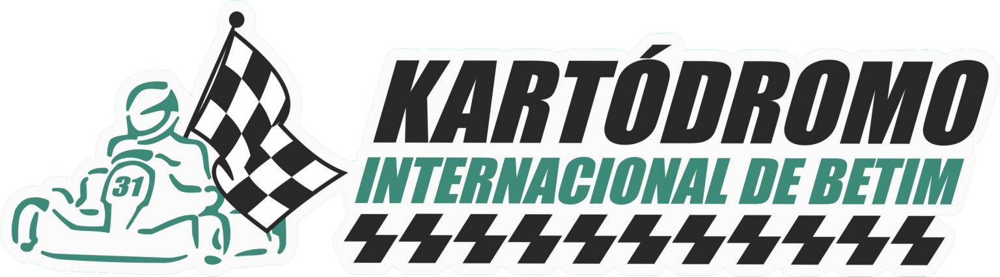

# Brandbook e Direção Visual - Kartódromo Internacional de Betim

Versão: 1.0
Data: 2026-06-20
Objetivo: orientar o redesign completo do site do Kartódromo Internacional de Betim, mantendo a logo original e migrando a experiência para uma linguagem clara, premium, técnica e com energia de motorsport.

## 1. Resumo Executivo

O novo site deve posicionar o Kartódromo Internacional de Betim como uma experiência de corrida acessível, bem estruturada e visualmente forte. A direção recomendada combina três referências:

- AudiF1: presença premium, hero cinematográfico, uso de veículo como protagonista e sensação de velocidade controlada.
- Planet Eaters: impacto imersivo, narrativa visual marcante e composição com profundidade.
- Momentum: organização modular, clareza de interface, blocos úteis e leitura rápida.

A adaptação para o Kartódromo deve evitar o visual escuro dominante. A base passa a ser clara, mineral e técnica, com contrastes de grafite, verde da marca, vermelho racing para ações e amarelo como acento pontual de energia.

Princípio central:

> Motorsport claro, premium e funcional, com a logo original preservada.

## 2. Logo Original

Arquivo oficial atual:



Caminho no projeto:

```text
/public/brand/kib-logo.png
```

Dimensão do arquivo:

```text
1536 x 427 px
PNG com transparência
```

### 2.1 Regra Principal

A logo original deve ser mantida. O redesign não deve redesenhar símbolo, tipografia, bandeira, kart, piloto, proporção, contorno ou composição.

O que pode ser feito:

- aplicar a logo em fundos melhores;
- definir áreas de respiro;
- escolher versões de aplicação por contexto;
- melhorar contraste ao redor da logo;
- criar um sistema visual que valorize a marca existente.

O que não deve ser feito:

- alterar desenho da bandeira;
- mudar as letras da logo;
- remover o kart ou piloto;
- trocar o verde institucional;
- aplicar gradiente dentro da logo;
- inclinar, distorcer ou reconstruir a marca;
- usar a logo como marca d'água sem controle de contraste.

### 2.2 Cores Extraídas da Logo

A extração de cores dominantes do arquivo atual trouxe:

| Papel | HEX | OKLCH | Uso |
| --- | --- | --- | --- |
| Preto KIB | `#111111` | `oklch(17.8% 0.000 89.9)` | Logo, títulos fortes, texto premium |
| Branco KIB | `#F8F9F9` | `oklch(98.1% 0.001 197.1)` | Contorno da logo, áreas claras |
| Verde KIB | `#3B8B78` | `oklch(58.1% 0.084 175.2)` | Cor institucional principal |
| Verde claro KIB | `#B3DCCB` | `oklch(86.0% 0.049 168.1)` | Fundos suaves, chips, estados leves |
| Verde profundo | `#336255` | `oklch(45.9% 0.056 173.7)` | Hover, textos sobre fundo claro |
| Cinza técnico | `#5C5C5C` | aproximado | Texto secundário, metadados |

Essas cores devem continuar presentes, mas a interface não deve ficar monocromática em verde. O verde é identidade, não decoração excessiva.

### 2.3 Área de Respiro

Usar como unidade `X` a altura aproximada da palavra "INTERNACIONAL" dentro da logo.

Regras:

- desktop: mínimo de `1X` em todos os lados;
- mobile: mínimo de `0.75X`;
- hero e capa: preferir `1.5X`;
- nunca encostar em bordas, botões, textos ou linhas técnicas.

### 2.4 Tamanho Mínimo

| Contexto | Largura mínima |
| --- | --- |
| Header desktop | 176 px |
| Header mobile | 132 px |
| Footer | 188 px |
| Patrocínios ou grids | 120 px |
| Favicon/app icon | usar recorte simplificado apenas se for criado a partir da logo oficial |

### 2.5 Fundos Permitidos

Permitidos:

- fundo claro mineral `#F4F1EA`;
- fundo off-white `#F8F9F9`;
- fundo grafite `#111111`, quando a logo tiver contraste suficiente;
- imagem real com overlay claro ou escuro controlado;
- placa branca sólida sobre foto.

Evitar:

- fundo verde saturado atrás da logo verde;
- textura muito ruidosa;
- foto sem overlay;
- gradiente forte;
- fundo vermelho com logo completa.

## 3. Essência da Marca

### 3.1 Frase de Posicionamento

O Kartódromo Internacional de Betim é o lugar onde qualquer pessoa pode sentir a precisão, a adrenalina e a disputa de uma corrida real, com estrutura profissional e experiência simples de reservar.

### 3.2 Promessa

Da primeira volta ao pódio, a experiência deve parecer organizada, segura e emocionante.

### 3.3 Personalidade

| Atributo | Como aparece no site |
| --- | --- |
| Técnico | grids, dados objetivos, horários, mapas, métricas de pista |
| Energético | CTAs fortes, fotos em movimento, linhas de velocidade |
| Confiável | informações claras, preços e regras fáceis de entender |
| Competitivo | campeonatos, rankings, tempos, pódios |
| Acessível | linguagem direta, reserva simples, WhatsApp sempre visível |

### 3.4 O Que a Marca Não É

- Não é balada visual neon.
- Não é dashboard gamer escuro.
- Não é site institucional parado.
- Não é landing page genérica com cards decorativos.
- Não é F1 de luxo inacessível.

## 4. Direção Visual

### 4.1 Conceito

Pista clara, grafite técnico, velocidade vermelha.

A interface deve parecer construída sobre materiais de corrida:

- asfalto;
- zebra de pista;
- carenagem branca;
- sinalização técnica;
- telemetria;
- placas de box;
- luz de largada;
- bandeira quadriculada.

### 4.2 Tradução das Referências

| Referência | O que aproveitar | Como adaptar |
| --- | --- | --- |
| AudiF1 | hero premium, objeto central, scroll com sensação de velocidade | kart ou pista como protagonista, sem copiar carro F1 ou estética de montadora |
| Planet Eaters | páginas imersivas e composições fortes | profundidade com fotos reais, mapas de pista e blocos sobrepostos |
| Momentum | módulos limpos e leitura de produto | reservas, horários, campeonatos e eventos com organização de painel claro |

### 4.3 Fundo Claro

O fundo claro deve ser a regra. O site pode ter trechos escuros apenas para contraste, como:

- seção de ranking;
- bloco de campeonatos;
- footer;
- detalhe de luz de largada;
- overlay sobre vídeo/foto.

Proporção recomendada:

- 75% superfícies claras;
- 15% superfícies grafite;
- 10% superfícies coloridas ou fotográficas.

## 5. Paleta Principal

### 5.1 Tokens Recomendados

| Token | HEX | OKLCH | Função |
| --- | --- | --- | --- |
| `--kib-ink` | `#111111` | `oklch(17.8% 0.000 89.9)` | títulos, navegação, contraste máximo |
| `--kib-graphite` | `#202225` | `oklch(25.1% 0.006 258.4)` | fundos escuros pontuais |
| `--kib-muted` | `#6B7280` | `oklch(55.1% 0.023 264.4)` | texto secundário |
| `--kib-surface` | `#F8F9F9` | `oklch(98.1% 0.001 197.1)` | superfície principal |
| `--kib-warm-surface` | `#F4F1EA` | `oklch(95.9% 0.010 87.5)` | fundo institucional claro |
| `--kib-line` | `#E8ECE8` | `oklch(93.9% 0.007 145.5)` | bordas e divisórias |
| `--kib-green` | `#3B8B78` | `oklch(58.1% 0.084 175.2)` | institucional |
| `--kib-green-dark` | `#336255` | `oklch(45.9% 0.056 173.7)` | hover, texto verde |
| `--kib-green-soft` | `#B3DCCB` | `oklch(86.0% 0.049 168.1)` | chips, fundos leves |
| `--kib-racing-red` | `#D71920` | `oklch(56.1% 0.218 27.0)` | CTA principal, urgência, largada |
| `--kib-flag-yellow` | `#F2C94C` | `oklch(85.0% 0.146 90.5)` | promoções, alerta leve, destaque |

### 5.2 Hierarquia de Cor

| Papel | Cor |
| --- | --- |
| CTA principal | vermelho racing |
| CTA secundário | grafite ou verde profundo |
| Links | verde profundo |
| Destaques institucionais | verde KIB |
| Dados de performance | grafite, verde e amarelo pontual |
| Promoções | amarelo em baixa área, nunca como fundo dominante |

### 5.3 Uso Incorreto de Cor

Evitar:

- site inteiro verde;
- grandes áreas em vermelho;
- fundo branco puro `#FFFFFF` em massa;
- texto verde claro sobre branco;
- botões amarelos com texto branco;
- degradês roxo/azul sem relação com kartismo.

## 6. Tipografia

### 6.1 Sistema Recomendado

Manter uma dupla tipográfica simples:

- Display e títulos: Montserrat, já presente no projeto.
- Texto e interface: Inter, já presente no projeto.

Isso reduz risco de inconsistência e aproveita o que já está implementado.

### 6.2 Hierarquia

| Estilo | Uso | Diretriz |
| --- | --- | --- |
| Display XL | hero e páginas principais | caixa alta, peso 800/900, linha compacta |
| H1 | título de página | 48-72 px desktop, 36-44 px mobile |
| H2 | seções | 32-48 px desktop, 28-34 px mobile |
| H3 | cards e blocos | 20-28 px |
| Body | texto corrido | 16-18 px, line-height 1.55 |
| Meta | labels técnicos | 11-13 px, caixa alta, tracking moderado |

### 6.3 Tom Tipográfico

Títulos podem ser fortes e curtos:

- "Acelere em Betim"
- "Reserve sua bateria"
- "Pista padrão internacional"
- "Campeonatos e desafios"
- "Eventos que viram corrida"

Textos longos devem ser diretos, com limite de leitura em torno de 65 a 75 caracteres por linha.

## 7. Sistema Gráfico

### 7.1 Elementos

Usar elementos inspirados em corrida, mas com controle:

- linhas de velocidade finas;
- diagonais de 8 a 12 graus;
- grid técnico sutil;
- marcas de zebra da pista;
- chips com dados;
- placas de box;
- contornos de pista;
- numeração grande para módulos e estatísticas.

### 7.2 Bordas e Raios

O estilo deve ser preciso, não arredondado demais.

| Elemento | Raio |
| --- | --- |
| Botões | 8 px |
| Cards | 8 px |
| Inputs | 8 px |
| Chips | 999 px quando forem pills |
| Media blocks | 8-12 px |

Não usar cards dentro de cards.

### 7.3 Sombras

Sombras devem ser raras e suaves:

```css
box-shadow: 0 18px 45px rgba(17, 17, 17, 0.08);
```

Preferir bordas finas, contraste de superfície e escala.

## 8. Fotografia e Vídeo

### 8.1 Direção de Imagem

Priorizar imagens reais:

- kart em movimento;
- pilotos no grid;
- pista em curva;
- detalhes de capacete;
- largada;
- pódio;
- equipe e atendimento;
- eventos corporativos;
- tomada aérea ou mapa da pista.

### 8.2 Tratamento Visual

Para manter o fundo claro:

- fotos com alto contraste, mas sem escurecer a página toda;
- overlay branco quente em seções claras;
- overlay grafite apenas quando texto estiver sobre imagem;
- crop amplo para mostrar pista e contexto;
- evitar blur pesado.

### 8.3 Hero

O hero ideal deve ter:

- vídeo ou foto real em tela cheia horizontal;
- lavagem clara para legibilidade;
- título grande em bloco curto;
- CTA "Reservar agora";
- CTA secundário "Falar no WhatsApp";
- estatísticas compactas: extensão, motores, anos, modalidades;
- uma linha técnica ou mapa da pista como camada secundária.

## 9. Voz e Mensagem

### 9.1 Tom

Direto, energético e confiável.

Exemplo:

```text
Sinta a pista, escolha sua bateria e venha correr em Betim.
```

Evitar:

```text
Venha viver momentos inesquecíveis em uma estrutura diferenciada.
```

### 9.2 Verbos Preferidos

- acelerar;
- reservar;
- correr;
- disputar;
- treinar;
- comemorar;
- desafiar;
- chegar;
- vencer.

### 9.3 CTAs

Primários:

- Reservar agora
- Ver horários
- Falar no WhatsApp

Secundários:

- Conhecer a pista
- Ver modalidades
- Ver campeonatos
- Planejar evento

Evitar CTAs genéricos:

- Saiba mais;
- Clique aqui;
- Conheça.

## 10. UI do Site

### 10.1 Header

Direção:

- manter logo à esquerda;
- header branco/off-white;
- navegação compacta;
- CTA vermelho à direita;
- WhatsApp como ação fixa ou secundária;
- top bar mais limpa, sem excesso de informações.

Estrutura recomendada:

```text
[Logo]  Pista  Locação  Reservas  Campeonatos  Eventos  Dúvidas  [Reservar]
```

Top bar:

```text
Betim, MG | Ter-Sex 16h-22h | Sáb-Dom 08h-19h | WhatsApp
```

### 10.2 Botões

Primário:

- fundo `#D71920`;
- texto claro;
- ícone de calendário, seta ou WhatsApp;
- hover levemente mais escuro;
- altura mínima 44 px.

Secundário:

- fundo grafite ou superfície clara;
- borda `#D8DED8`;
- texto grafite;
- hover com fundo `#F4F1EA`.

### 10.3 Cards

Usar cards apenas para:

- modalidades;
- eventos;
- campeonatos;
- horários;
- perguntas frequentes;
- destaques de pista.

Cada card deve ter:

- título curto;
- dado útil;
- ação clara;
- imagem ou ícone quando necessário;
- borda sutil;
- sem excesso de sombra.

### 10.4 Inputs e Reserva

Reserva deve parecer simples, quase como checkout:

1. Escolher modalidade.
2. Escolher data.
3. Escolher horário.
4. Informar nome e contato.
5. Confirmar pelo WhatsApp ou sistema.

Estados:

- disponível: verde controlado;
- selecionado: vermelho racing ou grafite forte;
- indisponível: cinza claro com texto legível;
- atenção: amarelo com texto escuro.

## 11. Arquitetura do Site

### 11.1 Home

Seções recomendadas:

1. Hero com vídeo/foto, CTAs e estatísticas.
2. Barra rápida de reserva.
3. Modalidades principais.
4. Pista em destaque com mapa e números.
5. Karts e categorias.
6. Campeonatos.
7. Eventos corporativos e aniversários.
8. Galeria real.
9. FAQ rápido.
10. Contato, mapa e WhatsApp.

### 11.2 Página "A Pista"

Objetivo: provar estrutura e gerar desejo.

Blocos:

- hero com mapa/traçado;
- dados técnicos;
- fotos por trecho;
- segurança;
- estrutura;
- localização;
- CTA para reserva.

### 11.3 Página "Locação"

Objetivo: converter visitante em piloto.

Blocos:

- modalidades de locação;
- como funciona;
- requisitos;
- valores ou chamada para consulta;
- equipamentos;
- reserva.

### 11.4 Página "Reservas"

Objetivo: reduzir atrito.

Blocos:

- agenda;
- horários;
- modalidades;
- regras rápidas;
- confirmação.

### 11.5 Página "Campeonatos"

Objetivo: mostrar comunidade e competição.

Blocos:

- campeonato atual;
- calendário;
- ranking;
- resultados;
- regulamento;
- inscrição.

### 11.6 Página "Eventos"

Objetivo: vender experiência para grupos.

Blocos:

- eventos corporativos;
- aniversários;
- confraternizações;
- pacotes;
- estrutura;
- formulário/WhatsApp.

### 11.7 Página "Dúvidas"

Objetivo: remover objeções.

Categorias:

- idade e altura;
- segurança;
- roupas;
- chuva;
- reserva;
- pagamento;
- grupos;
- campeonatos.

## 12. Componentes do Design System

### 12.1 Átomos

- Button;
- IconButton;
- Link;
- Badge;
- Chip;
- Input;
- Select;
- Checkbox;
- Radio;
- Tooltip;
- Separator;
- StatNumber;
- SectionLabel.

### 12.2 Moléculas

- BookingField;
- StatCard;
- TrackMetric;
- ScheduleSlot;
- WhatsAppCTA;
- PriceSummary;
- EventTypeCard;
- FAQItem;
- MediaCaption;

### 12.3 Organismos

- Header;
- HeroMotorsport;
- QuickBooking;
- TrackOverview;
- ModalityGrid;
- ChampionshipPanel;
- EventPlanner;
- GalleryStrip;
- FAQAccordion;
- ContactMap;
- Footer.

### 12.4 Templates

- HomeTemplate;
- TrackPageTemplate;
- RentalPageTemplate;
- BookingPageTemplate;
- ChampionshipPageTemplate;
- EventsPageTemplate;
- FAQPageTemplate.

## 13. Motion

### 13.1 Princípios

Movimento deve comunicar velocidade, não enfeitar.

Usar:

- opacity;
- transform;
- pequenos deslocamentos horizontais;
- linhas de velocidade;
- reveal por scroll;
- parallax leve em imagens.

Evitar:

- bounce;
- elastic exagerado;
- animação infinita em textos importantes;
- movimento que atrapalhe leitura;
- layout shift.

### 13.2 Microinterações

| Elemento | Movimento |
| --- | --- |
| Botão primário | brilho diagonal rápido no hover |
| Cards | translateY(-2px) |
| Slots de horário | troca clara de estado |
| Header sticky | sombra/borda ao rolar |
| Galeria | arraste horizontal com snap |
| Mapa da pista | linha animada sutil |

## 14. Acessibilidade

Regras mínimas:

- contraste WCAG AA;
- botões com 44 px de altura mínima;
- foco visível;
- textos não menores que 14 px em informações relevantes;
- não depender só de cor para estados;
- vídeos sem autoplay sonoro;
- respeitar `prefers-reduced-motion`;
- alt text descritivo nas imagens reais.

## 15. SEO e Conteúdo

### 15.1 Termos Principais

- kartódromo em Betim;
- kart em Betim;
- kartódromo Minas Gerais;
- kart para grupos;
- eventos corporativos Betim;
- campeonato de kart;
- aluguel de kart;
- pista de kart Betim.

### 15.2 Estrutura de Página

Cada página deve ter:

- H1 único;
- título SEO;
- meta description;
- CTA acima da dobra;
- conteúdo local com Betim/MG;
- perguntas frequentes quando aplicável;
- schema para LocalBusiness/Event quando possível.

## 16. Roteiro Visual em 49 Módulos

O anexo traz módulos de apresentação de brandbook em formato Behance. A leitura técnica encontrou módulos numerados de 0 a 49. Para este projeto, o módulo 0 funciona como capa e os módulos 1 a 49 formam o miolo reaproveitável da apresentação.

Não é recomendado copiar imagens, marcas ou layouts de terceiros. O aproveitamento deve ser estrutural: ritmo, sequência, tipo de página, densidade visual e lógica de apresentação.

### Módulo 0 - Capa

Conteúdo:

- logo original;
- fundo claro mineral;
- foto ou render da pista em baixa opacidade;
- título "Kartódromo Internacional de Betim";
- subtítulo "Brandbook e redesign digital".

Direção:

- impacto premium;
- composição ampla;
- sem excesso de texto.

### Módulo 1 - Manifesto

Mostrar a ideia central:

```text
Corrida real, reserva simples, experiência memorável.
```

Visual:

- frase grande;
- detalhe de bandeira quadriculada;
- imagem real de kart em movimento.

### Módulo 2 - Diagnóstico Atual

Mostrar a oportunidade:

- preservar reconhecimento da marca;
- atualizar percepção visual;
- facilitar reserva;
- organizar modalidades e campeonatos.

### Módulo 3 - Território Visual

Apresentar os três pilares:

- claro;
- técnico;
- veloz.

### Módulo 4 - Referências Traduzidas

Comparar:

- premium de corrida;
- landing imersiva;
- módulos funcionais.

Sempre indicar que são referências de direção, não fontes para cópia.

### Módulo 5 - Logo Oficial

Aplicar a logo original em destaque.

Incluir:

- versão principal;
- proporção;
- arquivo oficial;
- regra de não alteração.

### Módulo 6 - Área de Proteção

Exibir respiro da logo com grid.

### Módulo 7 - Tamanho Mínimo

Mostrar aplicações:

- header;
- mobile;
- footer;
- patrocínio;
- avatar/social.

### Módulo 8 - Fundos de Logo

Mostrar fundos permitidos:

- claro mineral;
- branco KIB;
- grafite;
- foto com overlay.

### Módulo 9 - Usos Incorretos

Mostrar proibições:

- distorcer;
- mudar a cor;
- aplicar sombra pesada;
- usar sobre foto ruidosa;
- aplicar sobre vermelho.

### Módulo 10 - Paleta Base

Mostrar swatches:

- preto KIB;
- branco KIB;
- verde KIB;
- verde claro;
- grafite.

### Módulo 11 - Paleta de Ação

Mostrar:

- vermelho racing;
- amarelo bandeira;
- cinzas técnicos.

### Módulo 12 - Proporção de Cores

Demonstrar a regra:

- 75% claro;
- 15% grafite;
- 7% verde;
- 3% vermelho/amarelo.

### Módulo 13 - Tipografia

Mostrar Montserrat e Inter:

- títulos fortes;
- labels técnicos;
- texto de leitura.

### Módulo 14 - Grid

Apresentar:

- container desktop;
- grid de 12 colunas;
- grid mobile;
- diagonais controladas.

### Módulo 15 - Sistema de Ícones

Usar ícones lineares:

- calendário;
- mapa;
- relógio;
- troféu;
- capacete;
- WhatsApp;
- seta.

### Módulo 16 - Elementos Gráficos

Mostrar:

- linhas de velocidade;
- zebra;
- grid;
- números grandes;
- mapa de pista.

### Módulo 17 - Fotografia

Apresentar direção:

- movimento real;
- pista;
- pilotos;
- grupos;
- pódio.

### Módulo 18 - Tratamento de Imagem

Mostrar antes/depois:

- imagem crua;
- overlay claro;
- contraste controlado;
- corte para hero.

### Módulo 19 - Voz da Marca

Exibir exemplos de títulos, CTAs e microcopy.

### Módulo 20 - Homepage: Hero

Mockar a primeira dobra:

- logo no header;
- título curto;
- vídeo/foto;
- CTA de reserva;
- WhatsApp;
- estatísticas.

### Módulo 21 - Homepage: Reserva Rápida

Mostrar componente com:

- modalidade;
- data;
- horário;
- CTA.

### Módulo 22 - Homepage: Modalidades

Cards para:

- locação;
- grupos;
- campeonatos;
- eventos.

### Módulo 23 - Homepage: A Pista

Seção com:

- mapa;
- extensão/configurações;
- fotos;
- CTA.

### Módulo 24 - Homepage: Karts

Mostrar categorias, motores e experiência.

### Módulo 25 - Homepage: Campeonatos

Painel com:

- próximo campeonato;
- ranking;
- calendário;
- inscrição.

### Módulo 26 - Homepage: Eventos

Mostrar pacotes para:

- empresas;
- aniversários;
- grupos de amigos;
- confraternizações.

### Módulo 27 - Homepage: Galeria

Galeria horizontal com fotos reais e legendas curtas.

### Módulo 28 - Homepage: FAQ

Accordion limpo com dúvidas principais.

### Módulo 29 - Homepage: Contato

Mapa, horário, telefone, WhatsApp e endereço.

### Módulo 30 - Página "A Pista"

Layout completo da página:

- hero técnico;
- mapa;
- dados;
- segurança;
- estrutura.

### Módulo 31 - Página "Locação"

Layout com jornada:

- como funciona;
- requisitos;
- equipamentos;
- reserva.

### Módulo 32 - Página "Reservas"

Interface funcional:

- calendário;
- slots;
- formulário;
- confirmação.

### Módulo 33 - Página "Campeonatos"

Sistema:

- banner do campeonato;
- etapas;
- ranking;
- regulamento;
- resultados.

### Módulo 34 - Página "Eventos"

Apresentar:

- tipos de evento;
- fluxo de orçamento;
- diferenciais;
- galeria;
- CTA.

### Módulo 35 - Página "Dúvidas"

FAQ categorizado, com busca se necessário.

### Módulo 36 - Componentes: Botões

Mostrar estados:

- default;
- hover;
- focus;
- disabled;
- loading.

### Módulo 37 - Componentes: Formulários

Mostrar:

- input;
- select;
- calendário;
- slot;
- validação;
- erro.

### Módulo 38 - Componentes: Cards

Mostrar variações:

- modalidade;
- evento;
- campeonato;
- métrica;
- mídia.

### Módulo 39 - Componentes: Badges e Chips

Usos:

- aberto;
- esgotado;
- promoção;
- novo;
- confirmado;
- em breve.

### Módulo 40 - Mobile

Mostrar:

- header compacto;
- menu;
- hero mobile;
- reserva rápida;
- sticky CTA.

### Módulo 41 - Responsividade

Breakpoints:

- 360 px;
- 768 px;
- 1024 px;
- 1280 px;
- 1440 px.

### Módulo 42 - Motion

Mostrar storyboard:

- entrada de hero;
- hover de CTA;
- linha de pista animada;
- troca de slot.

### Módulo 43 - Acessibilidade

Exibir:

- contraste;
- foco;
- área de toque;
- redução de movimento.

### Módulo 44 - Social Media

Aplicações:

- post de campeonato;
- story de reserva;
- anúncio de evento;
- resultado de ranking.

### Módulo 45 - Materiais Físicos

Aplicações:

- credencial;
- placa de box;
- banner;
- pulseira;
- voucher.

### Módulo 46 - Sinalização

Aplicações:

- entrada;
- recepção;
- fila;
- briefing;
- pódio.

### Módulo 47 - Tokens de Implementação

Mostrar CSS/Tailwind:

```css
:root {
  --kib-ink: oklch(17.8% 0.000 89.9);
  --kib-surface: oklch(98.1% 0.001 197.1);
  --kib-warm-surface: oklch(95.9% 0.010 87.5);
  --kib-green: oklch(58.1% 0.084 175.2);
  --kib-green-dark: oklch(45.9% 0.056 173.7);
  --kib-racing-red: oklch(56.1% 0.218 27.0);
  --kib-flag-yellow: oklch(85.0% 0.146 90.5);
}
```

### Módulo 48 - Roadmap de Redesign

Fases:

1. ajustar tokens e base visual;
2. redesenhar header/footer;
3. refazer hero e home;
4. refazer páginas internas;
5. revisar reserva;
6. validar mobile;
7. publicar.

### Módulo 49 - Fechamento

Tela final com:

- logo original;
- frase de marca;
- CTAs principais;
- visão do novo site.

Frase sugerida:

```text
Kartódromo Internacional de Betim.
Sua próxima corrida começa aqui.
```

## 17. Direção de Implementação

### 17.1 Prioridade Visual

Ordem recomendada:

1. Tokens de cor e superfícies claras.
2. Header mais limpo e CTA forte.
3. Hero cinematográfico claro.
4. Reserva rápida mais objetiva.
5. Cards de modalidades com informação real.
6. Página de pista com mapa e métricas.
7. Campeonatos com leitura de dashboard claro.
8. Eventos com prova visual.

### 17.2 Não Alterar Ainda

Até haver aprovação visual:

- não trocar a logo;
- não criar mascote;
- não inventar slogan definitivo;
- não fechar preços sem validação;
- não publicar imagens de referência de terceiros.

### 17.3 Entregáveis Recomendados

Para transformar este brandbook em site:

- homepage nova em alta fidelidade;
- tokens no Tailwind;
- componente `Button`;
- componente `SectionHeader`;
- componente `QuickBooking`;
- componente `TrackMap`;
- componente `ChampionshipPanel`;
- revisão mobile por captura;
- checklist de acessibilidade.

## 18. Checklist de Aprovação

Antes de implementar, validar:

- a logo original aparece preservada e valorizada;
- o site parece mais claro que escuro;
- o vermelho é usado só para ação;
- o verde mantém vínculo com a marca;
- as fotos parecem reais e locais;
- a reserva fica visível na primeira dobra;
- o mobile tem CTA fixo ou muito acessível;
- páginas internas seguem o mesmo sistema;
- não há cards aninhados;
- textos cabem em todos os botões e cards;
- contraste atende WCAG AA;
- referências foram traduzidas, não copiadas.

## 19. Síntese Final

O novo Kartódromo Internacional de Betim deve parecer uma pista organizada para correr agora: visual claro, técnico, rápido e confiável. A logo original continua sendo a âncora de reconhecimento. O redesign deve construir em volta dela uma linguagem mais contemporânea, com energia de corrida e interface simples o suficiente para converter visita em reserva.
